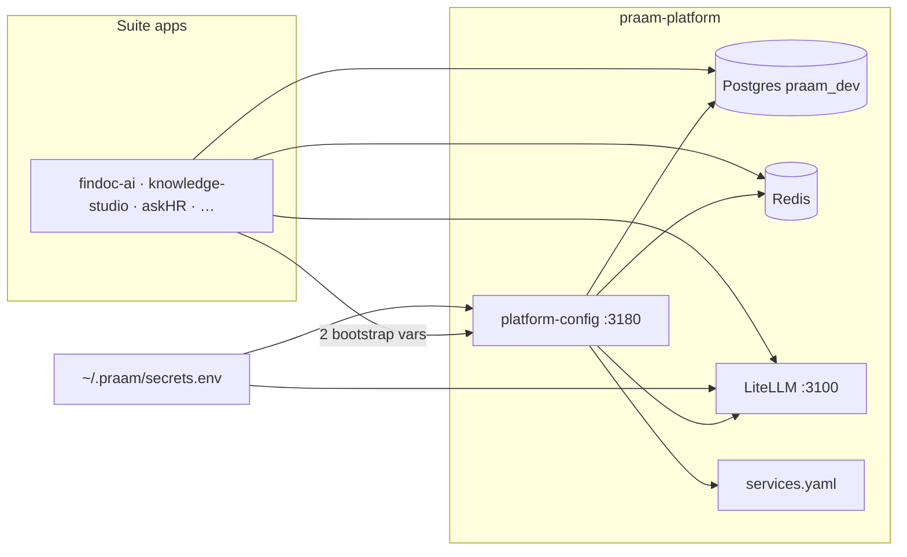

# praam-platform

Shared **local dev platform** for the [Praam](https://github.com/orgs/praamai) suite — one Postgres, Redis, LiteLLM gateway, and a config API instead of duplicating infra in every repo.

**Version 1.1.0** · dev-only (prod → RDS, ElastiCache, managed AI gateway)

## What it does

- **Infra** — Postgres `praam_dev` (schema per app), Redis, LiteLLM on `praam-network`
- **Config plane** — `services.yaml` + **platform-config API** (`:3180`) serve DB URLs, Redis, LiteLLM, ports at runtime
- **Secrets** — provider keys in **`~/.praam/secrets.env` only** (LiteLLM + secrets API)
- **SDK** — `PlatformClient("app-key").load()` in `lib/praam_platform/`

Not in this repo: app tables (Alembic in product repos), business logic, human login ([praam-pulse](https://github.com/praamai/praam-pulse)).



## Quick start

Requires [uv](https://docs.astral.sh/uv/) (`curl -LsSf https://astral.sh/uv/install.sh | sh`).

```bash
make bootstrap          # ~/.praam/secrets.env + uv sync (.venv)
# add OPENAI_API_KEY etc. to ~/.praam/secrets.env  (see .env.example)
make                    # up + verify + config smoke
make doctor DOCTOR_FLAGS=--platform-only
```

**Stack ports** (host → container):

| Service | Port | Docker hostname |
|---------|------|-----------------|
| Postgres | 15430 | `postgres:5432` |
| Redis | 16380 | `redis:6379` |
| LiteLLM | 3100 | `litellm:4000` |
| platform-config | 3180 | `platform-config:8080` |

Schemas: `findoc`, `knowledge_studio`, `prism`, `askhr`, `plan_copilot`, `pulse`.

`LEGACY_RENDER_ENV=1 make up` only if you still need `.env.platform.generated` in sibling repos.

## App config (preferred)

Two bootstrap vars, everything else from the API:

```python
from praam_platform import PlatformClient
PlatformClient("findoc-ai").load()
```

```bash
export PRAAM_CONFIG_URL=http://127.0.0.1:3180
export PRAAM_SERVICE_TOKEN=praam-platform-dev
curl http://127.0.0.1:3180/v1/apps/findoc-ai/config
```

Details: [docs/CONFIG_API.md](docs/CONFIG_API.md). Legacy fallback: `make render-env APP=findoc-ai`.

**Sync SDK to siblings:** `make sdk` copies `lib/praam_platform` (+ built TS package) into wired app repos. See [sdk/README.md](sdk/README.md).

## Security — no env files in app repos

**Do not keep `.env.platform.generated` in product repos** if you can avoid it. Those files sit on disk inside each app and can be copied or committed by mistake.

| What | Where it lives | In app repo? |
|------|----------------|--------------|
| `OPENAI_API_KEY` etc. | `~/.praam/secrets.env` | **No** — fetched via secrets API + token |
| DB URL, Redis, LiteLLM gateway | Config API at runtime | **No** — `PlatformClient.load()` applies to process memory only |
| Legacy `.env.platform.generated` | Sibling repo on disk | **Yes — avoid** (contains dev DB password + `LITELLM_MASTER_KEY`) |

Apps should only need **two bootstrap vars** (or defaults). Remove leftover legacy files:

```bash
make clean-legacy-env   # deletes .env.platform.generated from all siblings
```

Ensure each app repo gitignores `.env.platform.generated` and never commits it.

## Sibling apps

**Platform-wired:** findoc-ai, knowledge-studio, askhr — include `make/v1/platform.mk`, set `PRAAM_USE_PLATFORM=1`.

**Registered, wiring pending:** prism, production-plan-copilot, praam-pulse. **Shell:** demo-hub (:3000). Full list in [`services.yaml`](services.yaml). Status: [docs/STATUS.md](docs/STATUS.md).

Product repos: Docker apps use `postgres`/`redis`/`litellm` on `praam-network`; host apps use `127.0.0.1:15430`, `:16380`, `:3100`.

## Commands

Run `make help` for the full list. Common:

`bootstrap` · `up` · `down` · `check` (no Docker) · `doctor` · `backup-db` · `sdk` · `render-env`

Clone siblings next to this repo; override with `PRAAM_PLATFORM_ROOT=/path/to/praam-platform`.

## Layout

```text
services.yaml          lib/praam_platform/     services/platform-config/
pyproject.toml · uv.lock   sdk/typescript/       config/litellm.yaml
docker-compose.yml     make/v1/platform.mk       scripts/v1/
infra/postgres/init/
```

Docs: [CONFIG_API](docs/CONFIG_API.md) · [STATUS](docs/STATUS.md) · [PLATFORM_PLAN](docs/PLATFORM_PLAN.md) · [SCHEMA_MIGRATIONS](docs/SCHEMA_MIGRATIONS.md) · [AGENTS.md](AGENTS.md)
